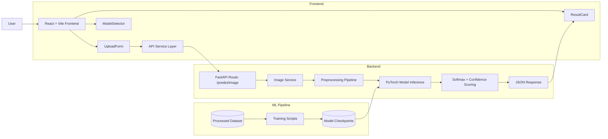

# DeepFakeShield

DeepFakeShield is an AI-powered image forensics platform that detects manipulated and AI-generated face images using deep learning.
It combines a React frontend, FastAPI backend, and a PyTorch inference pipeline for real-time classification.

## Project Highlights

- Multi-class face image detection (Real, Fake, AI-Generated)
- End-to-end web workflow: upload image, run inference, return confidence score
- FastAPI API service connected to trained model checkpoints
- React + Vite responsive frontend for fast interaction
- Modular architecture for easy model replacement and experimentation

## What Is Already Implemented

- Image upload pipeline from frontend to backend
- Model loading and inference in backend services
- Prediction response with class label and confidence
- Dataset preprocessing/training structure for multiple model variants
- Checkpoint-based model serving setup
- Local development workflow for both frontend and backend

## Future Implementation (Next Phase)

- Video deepfake detection with frame-level aggregation
- Explainable AI outputs (Grad-CAM / attention heatmaps)
- Ensemble inference across multiple backbones
- Authentication + user session history
- Cloud deployment with CI/CD and model versioning
- Monitoring dashboards (latency, confidence drift, throughput)
- Adversarial robustness and out-of-distribution checks
- API rate limiting and production hardening

## UI + Full Technical Diagram

## Tech Stack

- Python, FastAPI, Uvicorn
- PyTorch, TorchVision, OpenCV, Pillow
- React, Vite, JavaScript
- Docker (deployment-ready structure)

## Use Cases

- Academic research on synthetic media detection
- Awareness and educational demonstration
- Assistive screening for suspicious facial imagery
- Prototype foundation for media integrity systems

## Project Status

Active Final Year Project (2026), currently focused on improving robustness, explainability, and deployment readiness.

## Responsible Use

DeepFakeShield is an assistive detection tool and should be used with human verification in high-stakes scenarios.
Model outputs are probabilistic and may vary across unseen generators or highly compressed media.

## License

MIT License (or replace with your preferred license).