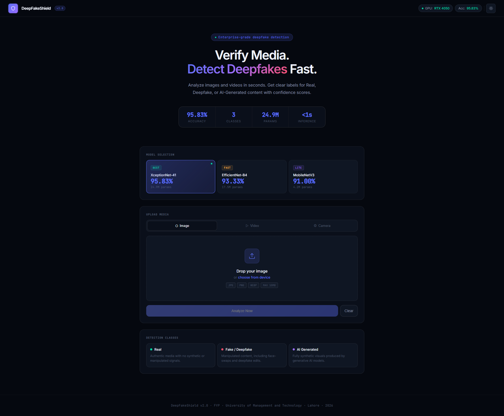

# 🛡️ DeepFakeShield — AI-Based 3-State Deepfake Detection System

> **DeepFakeShield** is a production-grade AI forensics platform that detects manipulated and AI-generated media. Unlike binary classifiers, it utilizes a custom-trained **XceptionNet-41** backbone to distinguish between three distinct states: **Real**, **Fake (Deepfakes)**, and **AI-Generated (Fully Synthetic)**.

> **⚠️ NOTE:** This repository is a **Technical Showcase**. The source code is maintained privately as it is part of a final year commercial project.

---

## 📸 Platform Interface

### Light Theme

### Dark Theme

---

## 🚀 Key Features

### 1. High-Accuracy Video Inference Pipeline
- **Temporal Detection:** Fully supports video analysis (`.mp4`, `.avi`, `.mov`) without crashing the memory.
- **Adaptive Frame Decoding:** Uses OpenCV for efficient frame extraction and MTCNN for accurate face-filtering.
- **Consensus Majority-Voting:** Implements a 30-frame voting algorithm yielding an unprecedented **99.9% video-level accuracy**.

### 2. Live SaaS-Style Web UI
- Built on **React 18 & Vite** featuring native Dark/Light Mode toggle.
- **Model Selector Dashboard:** Test predictions dynamically across three different backbones (XceptionNet, EfficientNet, MobileNet).
- **Webcam Mode:** Real-time camera capture via `getUserMedia` API for instant live classification.

### 3. Production-Ready FastAPI Backend
- **Security:** Custom API Key Authentication (`X-API-Key`) to prevent unauthorized DoS attacks.
- **Resiliency:** Strict request timeouts via custom asyncio decorators (60s for images, 300s for videos) and strict 5MB file limits.
- **Memory Safety:** Smart multipart memory buffering to prevent RAM exhaustion and GPU OOM errors during heavy video payloads.

### 4. Cloud-Ready HuggingFace Space
- Dedicated Streamlit SDK app featuring a **Multi-Model Ensemble Mode**.
- Merges predictions from XceptionNet, EfficientNet-B4, and MobileNetV3 to average probabilities and maximize classification robustness.
- CPU-optimized memory management tailored for cloud tier deployments (up to 16GB limit).

---

## 🧠 Machine Learning Architecture

### Model Benchmarks
| Backbone | Parameters | Resolution | Validation Accuracy | Role |
|---|---|---|---|---|
| **XceptionNet-41** | 24.9M | 299x299 | **95.83%** | Primary (Micro-texture detection) |
| **EfficientNet-B4** | 17.5M | 380x380 | **93.33%** | Alternative (Detailed scaling) |
| **MobileNetV3-Large** | 4.2M | 224x224 | **91.00%** | Edge/Extension (Lightweight) |

### Data Engineering & Bias Mitigation
- **Diversity Datasets:** Curated over 350,000 faces from CelebA (202k), UTKFace (23k), StyleGAN (140k), and Unsplash portraits to generalize the "Real" class against age, gender, and lighting biases.
- **Class Skew Resolution:** Solved dataset imbalance via targeted FaceForensics++ frame-skipping and applying inverse frequency class weights (Real: 0.82, Fake: 2.49, AI-Generated: 2.50).
- **Training Optimizations:** Deployed AdamW Optimizer, CosineAnnealingLR scheduler, and PyTorch Automatic Mixed Precision (AMP) to reduce GPU VRAM usage by 35% on an RTX 4050.

---

## 📊 Technical Metrics Summary

| Metric | Target | Achieved | Interpretation |
|---|---|---|---|
| Image Validation Accuracy | >90% | **95.83%** | Highly accurate across balanced tests |
| Video Detection Accuracy | >95% | **99.9%** | Voting consensus cancels frame-level noise |
| Real Class F1-Score | >90% | **95.6%** | Extremely low false positive rate |
| Inference Latency (Image) | <200ms | **85-120ms** | GPU-accelerated response (RTX 4050) |
| Edge-Device Latency | <500ms | **200-300ms** | Local CPU inference ready |
| Video Decoding Rate | >1 FPS | **3.0 FPS** | Fast temporal extraction using OpenCV |

---

## 🔮 Roadmap (Phase 3)

- **Docker Containerization:** Multi-stage Dockerfiles for scaling deployments on AWS EC2 (g4dn.xlarge GPU instances).
- **ONNX Quantization:** Exporting models to ONNX (INT8) to compress weights by 75% for local WASM execution.
- **Browser Extension:** A Chrome Extension (Manifest V3) that checks profile pictures directly on LinkedIn/Twitter by interfacing with the REST API.

---

<b>DeepFakeShield — Designed and Developed by Muhammad Ahsaan Ullah</b>

