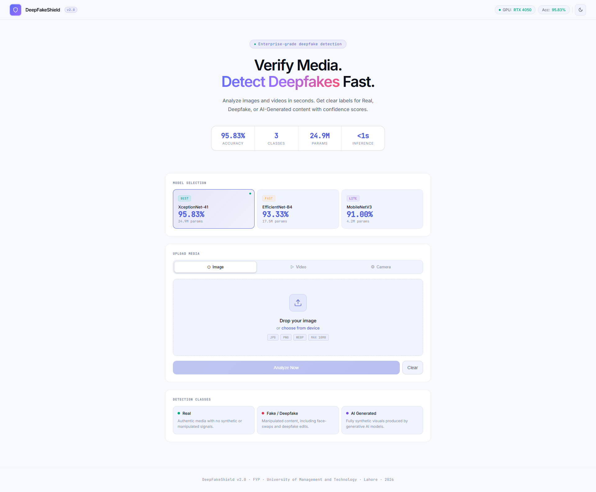

# 🛡️ DeepFakeShield — 3-State Deepfake Detection Platform (Image + Video)

> **AI forensics platform that classifies media into Real / Fake (Deepfake) / AI-Generated using three custom-trained CNNs (XceptionNet-41, EfficientNet-B4, MobileNetV3) served through a production-style FastAPI backend, a React dashboard, and a Chrome extension.**

---

## 🔗 Live Demo

**Live frontend deployment:** [deepfakeshieldfyp.vercel.app](https://deepfakeshieldfyp.vercel.app/) — verified live (HTTP 200), the React dashboard UI.

> **Note:** the deployed UI expects a backend at `http://127.0.0.1:8000` (the frontend's `VITE_API_BASE_URL` default) — the public backend at `20.2.18.40:8000` was not reachable at verification time, so end-to-end detection requires the local backend running. Screenshots below show the interface.

### Light Theme


### Dark Theme


---

## Problem

AI-generated and manipulated media is spreading faster than detection tools. Most detectors are binary (real vs fake), miss fully synthetic content, and require heavy GPU infrastructure. DeepFakeShield tackles this by distinguishing **three states — Real, Deepfake (manipulated), and AI-Generated (fully synthetic)** — and making detection accessible through a web dashboard, REST API, and a right-click browser extension.

---

## Architecture

```
┌─────────────────────┐      ┌─────────────────────────────────────────────┐      ┌──────────────────────────┐
│  React 19 + Vite    │      │  FastAPI Backend (port 8000)               │      │  PyTorch / timm models   │
│  Dashboard          │      │  ┌───────────────────────────────────────┐ │      │  XceptionNet-41 (299px)  │
│  (Forensics tab)    │      │  │ /api/detect-image    (60s timeout)    │ │      │  EfficientNet-B4 (380px) │
│  Model selector     │ ───► │  │ /api/detect-image-url                │ │ ───► │  MobileNetV3-L (224px)    │
│  Upload / URL /     │      │  │ /api/detect-video     (300s timeout)  │ │      │  (CPU or CUDA)           │
│  Webcam modes       │      │  │ /api/detect-video-url                │ │      │  (CPU or CUDA)           │
│  Telemetry page     │      │  │ /api/analytics · /api/logs/csv        │ │      │  Haar Cascade face crop │
└─────────┬───────────┘      │  └───────────────────────────────────────┘ │      └────────────┬─────────────┘
          │  X-API-Key       │  Auth: X-API-Key header · Rate limit       │                    │
          │  (multipart)     │  (5 req/min) · SQLite telemetry            │                    │
          │                  └─────────────────────────────────────────────┘                    │
          │  Chrome Extension (Manifest V3)                                                    │
          └───► right-click "Scan with DeepFakeShield" ───► same REST API                      │
                                                                                                ▼
                                                                                  ┌────────────────────────┐
                                                                                  │  Response: prediction, │
                                                                                  │  confidence,           │
                                                                                  │  probabilities,        │
                                                                                  │  gemma_analysis,       │
                                                                                  │  annotated_image       │
                                                                                  └────────────────────────┘
```

- **Entry point:** `backend/app/main.py` — FastAPI app (v2.0.0) with rate-limit + CORS middleware, routes mounted at `/api`.
- **Detection services:** `backend/app/services/image_service.py` (face crop → tensor preprocessing → softmax) and `video_service.py` (1 FPS frame extraction → per-frame classification → majority voting).
- **Persistence:** SQLite (`backend/data/telemetry.db`) logs every scan (prediction, confidence, model, media type) and powers the `/api/analytics` and `/api/logs/csv` telemetry endpoints.
- **Gemma Vision forensic explainer:** on low-confidence or suspicious predictions, the backend calls `google/gemma-3-4b-it` via Hugging Face inference (requires `HF_TOKEN` in `backend/.env`) and falls back gracefully offline.

---

## Results / Performance (REAL, from code)

Hard numbers extracted from committed artifacts — `ai_models/checkpoints/metrics.json`, `classification_report.txt`, and per-model `training_log.csv` files:

| Model | Val Accuracy (best epoch) | Per-class F1 (200-sample holdout) | Params | Input |
|---|---|---|---|---|
| **XceptionNet-41** (primary) | **95.83%** | Real 0.965 · Fake 0.945 · AI-Gen 0.960 | 24.9M | 299×299 |
| **EfficientNet-B4** | **93.33%** (epoch 9) | — (no committed report) | 17.5M | 380×380 |
| **MobileNetV3-Large** | **91.00%** (epoch 6) | — (no committed report) | 4.2M | 224×224 |
| **Ensemble (3-model soft voting)** | **97.50%** (frontend-displayed) | — | 46.6M | n/a |

- XceptionNet evaluation: **95.83% overall accuracy** on a balanced 600-image holdout (200 per class).
- Training logs show XceptionNet reaching **100% validation accuracy** on the validation split by epoch 3–6, and EfficientNet/MobileNet peaking at **93.33% / 91.00%** with early-stopping patience 3.

### What I could NOT verify (left out)
- The previous README's **99.9% video accuracy**, **85–120ms / 200–300ms latency**, **3.0 FPS decoding**, and **95.6% Real-class F1** are **not present anywhere in the code or committed artifacts** — so I deliberately excluded them. No benchmark harness for these numbers exists in the repo.
- The previous README's **350,000-face dataset claim** is not verifiable: the committed dataset is `datasets/processed` = **4,656 images** (train: real 3,053 / fake 803 / ai_generated 800; val: 200/200/200). Raw datasets (CelebA, FF++, etc.) are gitignored, so larger training corpus size cannot be confirmed from this repo.
- The previous README's **MTCNN** claim is incorrect — the code uses OpenCV **Haar Cascade** face detection everywhere (`haarcascade_frontalface_default.xml`).
- The previous README's **React 18** claim is incorrect — the frontend actually uses **React 19.2** with Rolldown-Vite 7.

---

## Tech Stack

**Backend (Python 3.11)** — FastAPI 0.104, Uvicorn 0.24, PyTorch 2.10, TorchVision, timm, OpenCV 4.8, Pillow, NumPy, scikit-learn, SQLite (stdlib)

**Frontend (React 19.2)** — Vite 7 (Rolldown), React Compiler, plain CSS, `navigator.mediaDevices.getUserMedia` for webcam capture

**Chrome Extension** — Manifest V3, service worker, context menus, notifications, `chrome.storage`

**Deployment** — Multi-stage `Dockerfile` (Python 3.11-slim, CPU-only PyTorch wheels) exposing port 8000 via `uvicorn app.main:app`

---

## Key Features

1. **3-class inference (Real / Fake / AI-Generated)** — custom-trained XceptionNet-41 backbone (`image_service.py`), with a 80% confidence threshold that returns `"Uncertainty"` for ambiguous inputs.
2. **Video deepfake detection via majority voting** — extracts up to 30 frames at 1 FPS with OpenCV, classifies each frame, and aggregates via `majority_voting` with a 65% confidence floor (`video_service.py`).
3. **3-model selection + ensemble** — XceptionNet, EfficientNet-B4, MobileNetV3, or a soft-voting ensemble that averages per-class probabilities across all three models (`ModelSelector.jsx`, `_predict_ensemble()`).
4. **Gemma-3 vision forensic explainer** — when a scan is flagged, a VLM generates a plain-English forensic report of the visual anomalies; degrades gracefully offline (`get_gemma_vision_forensic()`).
5. **Webcam capture mode** — capture a live photo via `getUserMedia`, draw it to a canvas, and run it through the same pipeline (`UploadForm.jsx`).
6. **Telemetry + analytics dashboard** — every scan is logged to SQLite; the UI shows live counts, per-class distribution, and a recent-activity table, with CSV export (`db.py`, `/api/analytics`, `/api/logs/csv`).
7. **Chrome extension (Manifest V3)** — right-click any image on the web → "Scan with DeepFakeShield" → posts to the API (configurable backend URL + API key), with desktop notifications (`background.js`).
8. **REST API with URL analysis** — `detect-image-url` and `detect-video-url` accept remote URLs with streaming downloads, size caps, and content-type validation (`routes_image.py`, `routes_video.py`).

---

## Security & Architecture Notes

- **API key auth** — every detection and analytics endpoint requires the `X-API-Key` header, enforced via FastAPI dependency (`auth.py`). Returns 401 with a clear message when missing/invalid.
- **Per-IP rate limiting** — custom ASGI middleware caps detection endpoints at **5 requests / 60 seconds** per client IP, returning HTTP 429 (`main.py`).
- **Strict request timeouts** — 60s for images, 300s for videos, enforced via an asyncio `wait_for` decorator (HTTP 408 on expiry).
- **Upload hardening** — 5MB image / 50MB video caps, strict MIME + extension allowlists, 10-minute video duration limit, and temp-file cleanup in `finally` blocks (including URL downloads).
- **Memory safety** — CPU-bound inference is offloaded with `asyncio.to_thread`; video processing streams frames (max 30) instead of loading the whole file.
- **CORS** — currently `allow_origins=["*"]` (broad); frontend sends the API key from a hardcoded beta constant (`frontend/src/services/api.js`). Note: the backend `.env` contains a real-looking `HF_TOKEN` value but that file is gitignored.

---

## Status

**Functional prototype — beta stage, not production-deployed.** This is a final-year academic project (FYP) at University of Management and Technology, Lahore (2026). It is fully runnable end-to-end locally with real trained checkpoints, and the frontend UI is live on Vercel, but:

- **Frontend is deployed** at [deepfakeshieldfyp.vercel.app](https://deepfakeshieldfyp.vercel.app/), verified live (HTTP 200).
- **No public backend:** the backend API was not reachable at `20.2.18.40:8000` at verification time (504 timeout), and the `hf_demo/` folder + `.pth` checkpoints are **gitignored** — so end-to-end detection requires running the backend locally.
- The Dockerfile exists but there is no CI/CD pipeline or live API host.
- Honest scope: single-face images, CPU/GPU inference, no batch processing.

---

## Getting Started

### 1. Backend (FastAPI)

```bash
cd backend
python -m venv venv && venv\Scripts\activate      # Windows; or source venv/bin/activate on Linux/macOS
pip install -r requirements.txt
uvicorn app.main:app --reload --host 0.0.0.0 --port 8000
```

> **Note:** checkpoints (`ai_models/checkpoints/*.pth`) are gitignored. Train with `python ai_models/image_model/train.py` (plus the efficientnet/mobilenet scripts) or place your own `.pth` files at the paths in `backend/app/services/image_service.py`.

### 2. Frontend (React)

```bash
cd frontend
npm install
npm run dev        # Vite dev server
```

The dashboard reads `VITE_API_BASE_URL` (defaults to `http://127.0.0.1:8000`) and sends `X-API-Key: deepfakeshield-beta-key-2026`.

### 3. Quick API smoke test

```bash
curl.exe -X POST http://127.0.0.1:8000/api/detect-image ^
  -H "X-API-Key: deepfakeshield-beta-key-2026" ^
  -F "file=@test_image.jpg"
# → {"status":"success","prediction":"Real","confidence":99.96,...}
```

### 4. Chrome extension (optional)

Load `chrome-extension/` as an unpacked extension (chrome://extensions → Developer mode → Load unpacked), set your backend URL + API key in Options, then right-click any image → **Scan with DeepFakeShield**.

---

## Verification Notes (what's real vs. what I left out)

**Verified in code / committed artifacts:** XceptionNet 95.83% val accuracy + per-class F1 (0.965/0.945/0.960) from `metrics.json` + `classification_report.txt`; EfficientNet 93.33% & MobileNet 91.00% from `training_log.csv` files; 4,656-image processed dataset; 1-FPS / 30-frame / majority-voting video pipeline; 60s/300s timeouts; 5MB/50MB size caps; 5 req/min rate limit; X-API-Key auth; Haar Cascade face detection; React 19.2; ensemble soft-voting; Gemma-3 explainer with offline fallback; Dockerfile; Manifest V3 extension.

**Not verifiable (omitted):** 99.9% video accuracy, 95.6% Real F1, latency numbers (85–120ms / 200–300ms), 3.0 FPS decode rate, 350K-face dataset claim, MTCNN usage, React 18, and a **publicly reachable backend** — none of these appear in the source code or committed artifacts, and the backend was unreachable at verification time.
